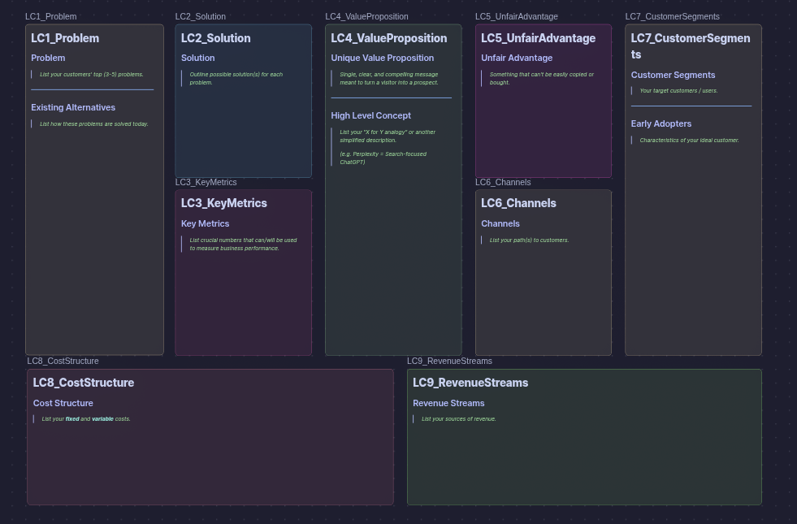

# Obsidian-LeanCanvas-Vault-Template
Obsidian-Importable Lean Canvas business planning template. Uses markdown notes + an Obsidian Canvas as a dashboard.

## Instructions

You can either:
- Download `LeanCanvas-Template.zip`, extract the files, and open the folder as a vault in Obsidian; OR
- Clone this repo and open the `LeanCanvas-Template` as a vault in Obsidian

The individual `.md` files make up `LC0_FullCanvas.canvas`, the main "dashboard" view of the plan. `.canvas` files require Obsidian to view properly.

## Credit
This template is inspired by Steve Mullen's adaptation of the Lean Canvas business planning method. Their original medium article can be found here: https://medium.com/@steve_mullen/an-introduction-to-lean-canvas-5c17c469d3e0
